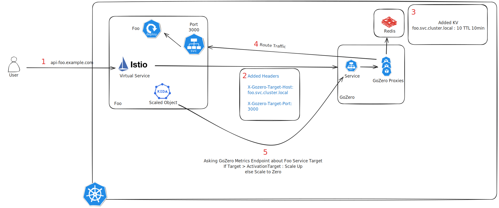

# Design of GoZero

`GoZero` is a reverse-proxy with some additional features, which can support scaling services from zero to desired number of replicas and vice versa by relying on `KEDA`.

## Components

GoZero has multiple internal components, which are designed to work together to achieve scaling services from zero to desired number of replicas and vice versa.

### Reverse Proxy

Reverse-proxy is responsible for routing HTTP/1.1, HTTP/2 (GRPC) requests to target services. As i decided to make reverse-proxy platfrom agnostic, there is no integration between GoZero and Kubernetes. So it doesn't know anything about Kubernetes.

We need to provide a way to tell GoZero how to route requests to target services. I decided to rely on `HTTP Header` to tell GoZero how to route requests to target services. Using header is flexible enough for most of the cases. They can also be used to customize reverse-proxy behavior.

The headers are:

- `X-Gozero-Target-Port`: The port of the target service.
- `X-Gozero-Target-Scheme`: The scheme of the target service.
- `X-Gozero-Target-Retries`: The number of retries for the target service, before giving up.
- `X-Gozero-Target-Backoff`: The backoff time for the target service, before retrying.

### Store

Store is responsible for storing the state of the target service. The state is used to determine the number of replicas of the target service.

By default, it uses `Redis` as the store, since it lets us to use multiple instances of GoZero to scale the same service. `Redis` TTL is used to expire the state of the target service which helps to scale to zero without implement any logic to delete the state.

We might add more store in the future, such as `MySQL` and `Local cache`.

When GoZero receive a request, it will update the state of the target service, then it will send the request to the target service. We set key which is target service name with value of the fixed value, which is `10`. This `value` is used to determine the number of replicas of the target service.

In future, we can implement a logic to make the value dynamic, which is based on the number of requests to the target service.

### Metric Exposer

KEDA is handling scaling logic, but we need to tell KEDA how many replicas are there. So we need to expose a metric to KEDA. We rely on [Metric API](https://keda.sh/docs/2.12/scalers/metrics-api/) to expose the metric.

So the metric exposer is responsible for exposing the metric to KEDA. When KEDA asks for a service which exists in the store, it will return the value of the key. Otherwise, it will return `0`.

## How it works

Following diagram shows how `GoZero` works.

1. User wants to access `api-foo.example.com`.
2. We expose the service using `Istio VirtualService (VS)`. `VS` is routing all requests to `GoZero` and set required headers.
3. GoZero is receiving the request and update the state of the target service in the store.
4. GoZero is sending the request to the target service.
5. KEDA ScaledObject is watching the metric exposed by `GoZero` and scale the target service, after expiring the TTL of the state in the store, the target service will be scaled to zero.

### From zero to desired number of replicas

When there is no replica of the target service, If GoZero sends request to the target service, it will be failed since there is no replica. We need to give time to KEDA to scale the target service to desired number of replicas. 

Instead of sending request to the target service and tells user that the service is not available, GoZero tries to send request to the target service until the target service is ready using retry-backoff logic, which can be controlled by using `X-Gozero-Target-Retries` and `X-Gozero-Target-Backoff` headers.